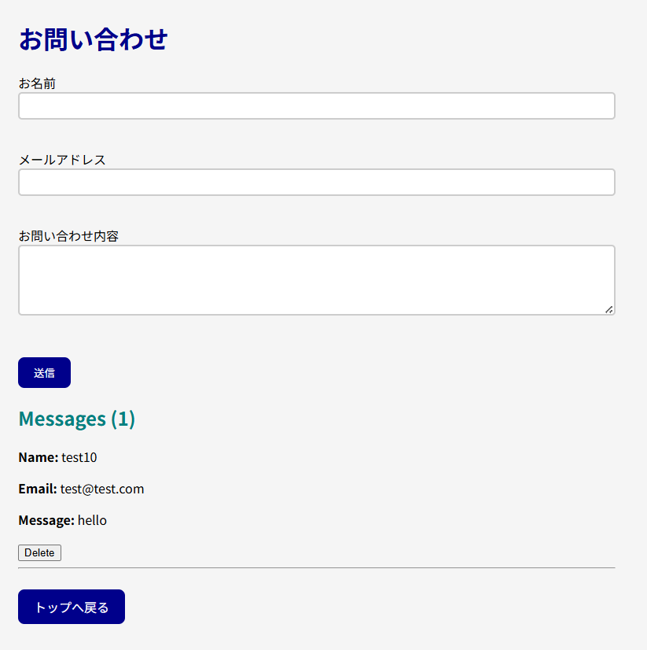

# Contact Manager

A simple contact management application built with **Node.js, Express, and Vanilla JavaScript**.

Users can submit messages through a contact form and manage them through a dynamic list interface.

## Features

- Add contacts through a form
- Display submitted contacts instantly
- Delete contacts from the list
- Data persistence using a JSON file
- REST API built with Express

## Tech Stack

- Node.js
- Express
- Vanilla JavaScript
- HTML
- CSS

---

## Screenshots

### Main Interface



### Contact Form


### Admin Dashboard


---

## Project Structure

```
contact-manager
│
├── public
│   ├── index.html
│   ├── script.js
│   └── style.css
│
├── screenshots
│   ├── app.png
│   ├── contact.png
│   └── admin.png
│
├── messages.json
├── server.js
└── README.md
```

## API Endpoints

### Get all contacts

GET /api/contact

Returns all stored contact messages.

### Create a contact

POST /api/contact

Adds a new contact message.

Request body:

{
  "name": "John",
  "email": "john@example.com",
  "message": "Hello"
}

### Delete a contact

DELETE /api/contact/:id

Deletes a contact by ID.

## Setup

1. Clone the repository

git clone https://github.com/your-username/contact-manager.git

2. Move into the project directory

cd contact-manager

3. Install dependencies

npm install

4. Start the server

node server.js

5. Open the application

http://localhost:3000

---

## Learning Goals

This project was built to practice:

- Building REST APIs with Express
- Using the Fetch API
- Client and server validation
- File-based data persistence
- REST API design with Express

---

## Future Improvements

- Add update functionality (complete CRUD)
- Add timestamps to messages
- Replace JSON storage with a database (SQLite / PostgreSQL)
- Improve UI styling
- Add pagination for large message lists

---