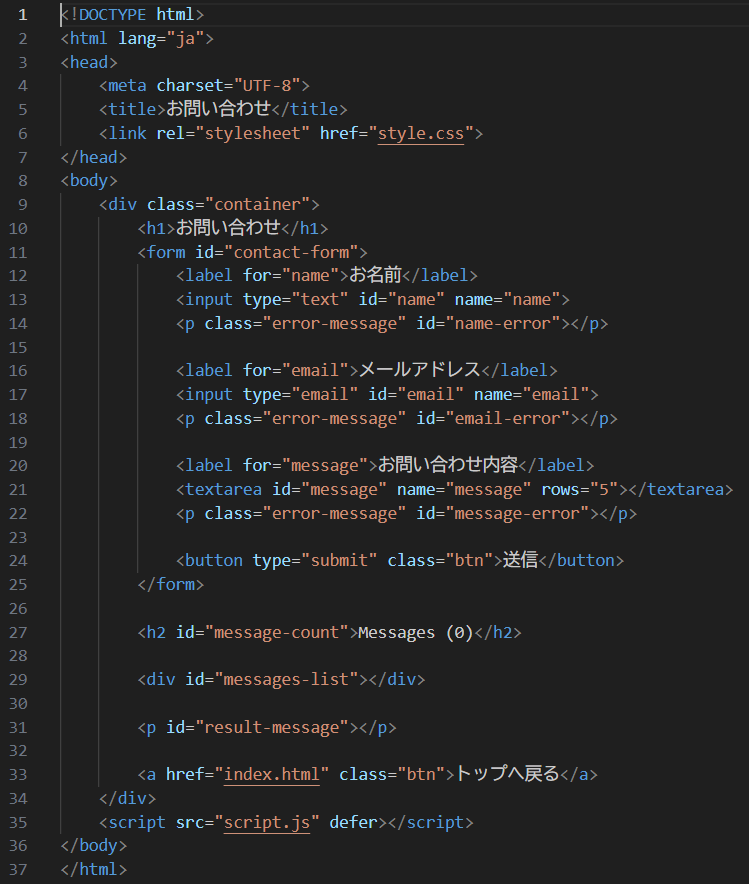
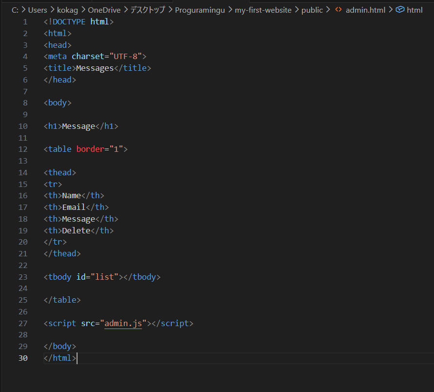

# Contact Manager

A simple contact form system built with **Node.js, Express, and Vanilla JavaScript**.
A simple full-stack contact management app built for learning Express and REST APIs.

Users can submit messages from a contact form, and the admin page allows viewing and deleting submitted messages.

---

## Screenshots

### Contact Form



### Admin Dashboard



---

## Features

- Submit messages from a contact form
- View submitted messages in the admin page
- Delete messages from the admin dashboard

CRUD status

- Create ✔
- Read ✔
- Delete ✔
- Update ✖

---

## Tech Stack

- Node.js
- Express
- Vanilla JavaScript
- HTML

---

## System Architecture

```
Browser
   │
   │ fetch API
   ▼
Express Server (server.js)
   │
   │ REST API
   ▼
messages[] (in-memory storage)
```

## Data Flow

```
Contact Form
      │
      ▼
POST /api/contact
      │
      ▼
messages[]
      │
      ▼
GET /api/messages
      │
      ▼
Admin Table
      │
      ▼
DELETE /api/messages/:id
```

## Project Structure

```
my-first-website
│
├ server.js
│
└ public
   ├ contact.html
   ├ admin.html
   └ admin.js
```

## API Endpoints

### POST /api/contact

Create a message

Example request

```json
{
"name": "John",
"email": "john@example.com",
"message": "Hello"
}
```

### GET /api/messages

Retrieve all messages.

---

### DELETE /api/messages/:id

Delete a message.

Example
```
DELETE /api/messages/1772624619725
```

## How to Run

Clone the repository

git clone https://github.com/yourname/my-first-website.git

Install dependencies

npm install

Start the server

node server.js

Open in browser

http://localhost:3000/contact.html

http://localhost:3000/admin.html

---

## Learning Goals

This project was built to practice:

- REST API development with Express
- Fetch API
- DOM manipulation
- CRUD fundamentals
- Simple admin dashboard

---

## Future Improvements

- Add timestamps to messages
- Add delete confirmation dialog
- Improve admin UI with CSS
- Store messages in a database

---

## Data Flow

```
Contact Form
      │
      ▼
POST /api/contact
      │
      ▼
messages[]
      │
      ▼
GET /api/messages
      │
      ▼
Admin Table
      │
      ▼
DELETE /api/messages/:id
```